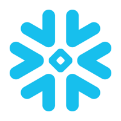

### Hi there, I'm Deivid 👋

- 🌱 I’m currently learning everything 🤣
- 👯 I’m looking to collaborate with other content creators
- 🥅 2020 Goals: Contribute more to Open Source projects

### Connect with me:

[][linkedin]

 

### Languages and Tools:

 

[linkedin]: https://www.linkedin.com/in/deivid-robim-200b3330/

